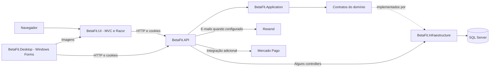
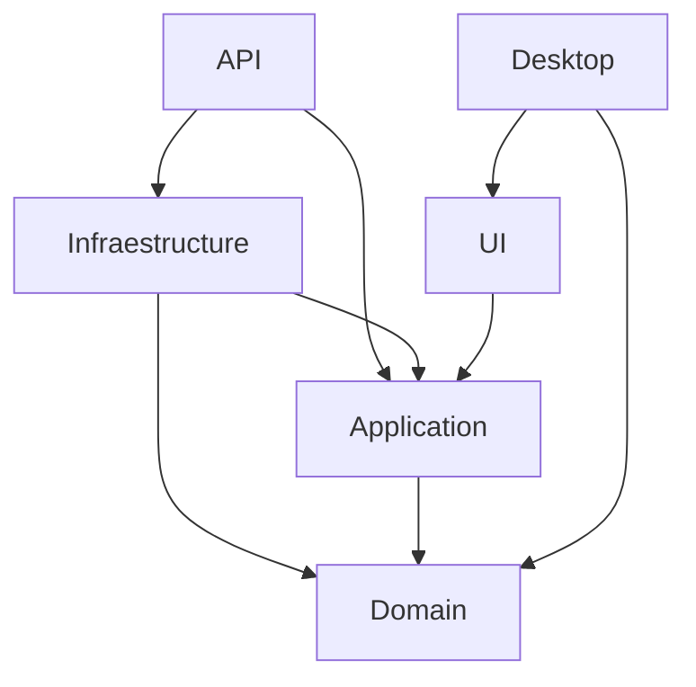
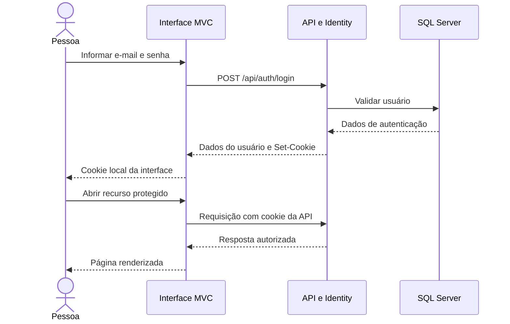
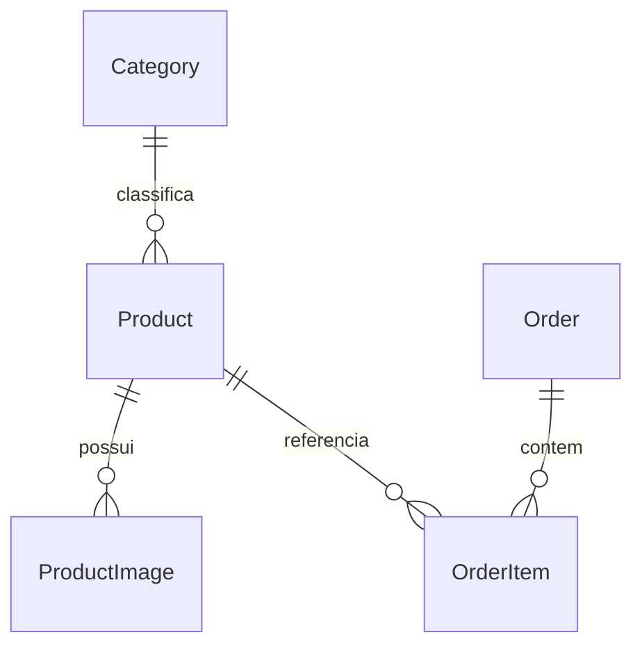

# Arquitetura e fluxos de dados

[Voltar ao README](../README.md)

## Visão geral

O BetaFit integra uma loja web, um aplicativo de gestão e uma API compartilhada. O banco é acessado pelo backend; os clientes realizam chamadas HTTP.

O diagrama representa o fluxo lógico das chamadas. As interfaces são associadas às implementações pelo container de injeção de dependência da API.

## Responsabilidades

| Projeto | Responsabilidade |
| --- | --- |
| `BetaFit.Domain` | Entidades, enums, regras auxiliares do domínio e interfaces de repositórios |
| `BetaFit.Application` | Serviços de aplicação, interfaces de serviços, DTOs e ViewModels |
| `BetaFit.Infraestructure` | `BetaFitDbContext`, acesso SQL Server, repositórios, migrations e seed do Identity |
| `BetaFit.API` | Rotas, autenticação, autorização, composição dos serviços, integrações e hub SignalR |
| `BetaFit.UI` | Controllers MVC, Views Razor, arquivos estáticos e serviços HTTP que consomem a API |
| `BetaFit.Desktop` | Forms, UserControls, sessão e serviços HTTP para gestão |

### Dependências declaradas nos projetos

As setas indicam `ProjectReference`. O Desktop referencia também a UI, mas executar o Desktop não inicia automaticamente o servidor web.

## Padrões utilizados

- **Camadas inspiradas em Clean Architecture:** separação entre domínio, aplicação, infraestrutura e apresentação.
- **Repository:** contratos do domínio e implementações de persistência para produtos, categorias, pedidos, cupons e frete.
- **Injeção de dependência:** a API registra serviços e repositórios para recebê-los pelos construtores.
- **DTOs:** contratos de entrada e saída compartilhados por partes da solução.
- **MVC:** organização da interface web em controllers, modelos e views.
- **Migrations:** evolução do esquema SQL Server pelo Entity Framework Core.

A arquitetura é híbrida: controllers como carrinho, favoritos e perfil utilizam diretamente o contexto ou componentes de infraestrutura. A Application também utiliza componentes do Identity. Essas dependências devem ser consideradas ao explicar ou evoluir a separação das camadas.

## Autenticação

A API utiliza ASP.NET Core Identity com **cookies**, sem emissão de JWT. Requisições sem autenticação recebem `401`; contas sem a permissão exigida recebem `403`.

A UI mantém seu cookie local e utiliza `ApiCookieHandler` para encaminhar o cookie da API. O Desktop mantém a sessão por seus helpers HTTP e de sessão.

O seed cria `Admin`, `Usuario` e `Funcionario`. Outros pontos do código usam também `Gerente` e `Estoquista`. Os conjuntos de permissões variam entre endpoints; por exemplo, o dashboard admite `Admin,Gerente`, enquanto a manutenção de produtos admite `Admin,Funcionario,Estoquista`.

## Persistência

`BetaFitDbContext` deriva de `IdentityDbContext`. Além das tabelas do Identity, há persistência para produtos, categorias, imagens, pedidos, itens, carrinho, favoritos, cupons, regras de frete, avaliações, suporte, notificações e configurações do site.

Relações centrais:

Esse é um recorte do modelo, não um diagrama completo do banco. Variações e outros dados também usam representações JSON; informações complementares de perfil e cartões demonstrativos usam claims. Consulte as entidades, `BetaFitDbContext` e migrations para o mapeamento completo.

## Fluxo de compra

1. O cliente consulta produtos e escolhe tamanho, cor e quantidade.
2. A API registra o carrinho por usuário e valida disponibilidade.
3. A cotação calcula valores a partir dos produtos e regras de frete; cupons são avaliados quando informados.
4. O checkout envia itens, endereço, regra de frete, total esperado e forma de pagamento.
5. A aplicação valida preços, estoque e demais regras antes de registrar o pedido e atualizar o estoque.
6. O cliente acompanha o pedido; a equipe atualiza o andamento conforme suas permissões.
7. Após a entrega, ficam disponíveis ações de avaliação e solicitação de reembolso, conforme as regras de cada rota.

Os valores do enum de status são `Pendente`, `EmPreparacao`, `Pronto`, `Entregue`, `Cancelado`, `Confirmado`, `Enviado` e `Reembolso`. O serviço define regras de avanço e bloqueios; a ordem numérica do enum não representa a ordem do processo.

## Notificações e imagens

A API persiste notificações e pode enviar e-mails pelo serviço Resend. Em uma atualização de status para `Entregue` pelo controller de pedidos, envia o evento `OrderFinalized`, com `orderId`, ao usuário no hub `/hubs/orders`.

As imagens locais usadas pela loja são servidas pela UI em `wwwroot/images/products`. O Desktop resolve a URL da UI para exibi-las. A existência de um diretório `wwwroot` na API não garante publicação de arquivos: o `Program.cs` analisado não registra `UseStaticFiles()` na API.
